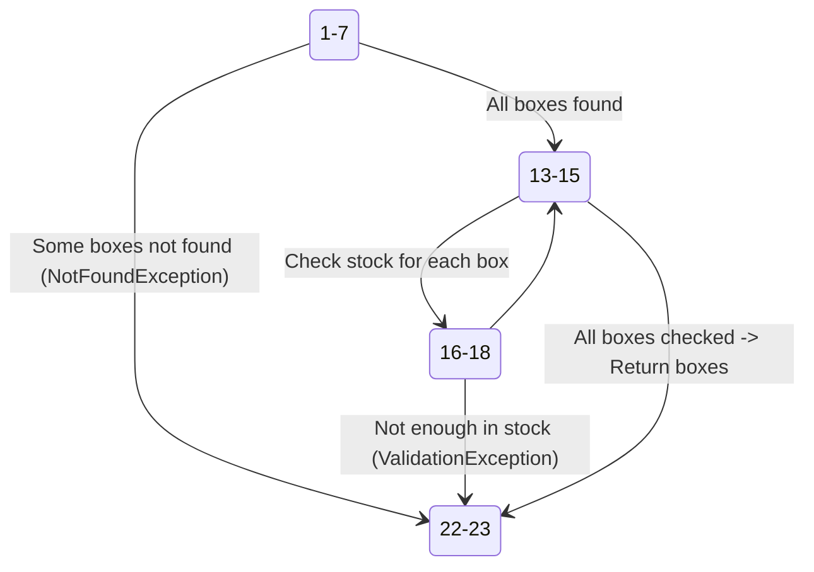
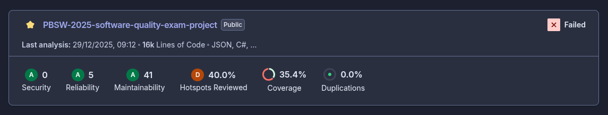

<!-- skip_slide -->

```csharp +line_numbers
public async Task<IEnumerable<Box>> GetBoxesForOderAsync(Dictionary<Guid, int> boxQuantities)
{
    var boxIds = boxQuantities.Keys;
    var boxes = (await boxRepository.GetBoxesByIdsAsync(boxIds)).ToList();

    // Check if all boxes exist
    if (boxes.Count != boxIds.Count)
    {
        var foundBoxIds = boxes.Select(b => b.Id);
        var missingBoxIds = boxIds.Except(foundBoxIds);
        throw new NotFoundException($"Boxes with ids {string.Join(", ", missingBoxIds)} not found");
    }

    // Check if each box is in the required stock
    foreach (var box in boxes)
    {
        var requiredQuantity = boxQuantities[box.Id];
        if (box.Stock < requiredQuantity)
            throw new ValidationException(
                $"Box with id {box.Id} does not have enough stock. Required: {requiredQuantity}, Available: {box.Stock}");
    }

    return boxes;
}
```

<!-- end_slide -->

<!-- skip_slide -->



<!-- end_slide -->

Continuous Integration
---

<!-- column_layout: [1, 1] -->

<!-- column: 0 -->

- PR validation with status checks
- GitHub Actions for automated workflows
- Build, test, and static analysis steps
- Coverage reports with Coverlet
- Integration with SonarCloud for code quality

<!-- column: 1 -->

```yaml
jobs:
  backend-tests:
    timeout-minutes: 10
    runs-on: ubuntu-latest
    steps:
    - name: Checkout repository
      uses: actions/checkout@v6

    - name: Set up .NET
      uses: actions/setup-dotnet@v5
      with:
        dotnet-version: '10.0.x'
        
    - name: Restore dotnet tools
      run: dotnet tool restore
      
    - name: Run SonarQube Scanner
      env:
        SONAR_TOKEN: ${{ secrets.SONAR_TOKEN }}
        JAVA_HOME: ${{ env.JAVA_HOME }}
      run: |
        dotnet sonarscanner begin \
          /k:"${{ github.repository_owner }}_${{ github.event.repository.name }}" \
          /o:"${{ github.repository_owner }}" \
          /d:sonar.token="$SONAR_TOKEN" \
          /d:sonar.cs.vstest.reportsPaths="**/*.trx" \
          /d:sonar.cs.opencover.reportsPaths="coverage.*.xml"
                
        make test-backend
        dotnet sonarscanner end /d:sonar.token="$SONAR_TOKEN"
```

<!-- end_slide -->

Continuous Integration
---



<!-- end_slide -->

Unit Testing
---

- AAA Pattern (Arrange, Act, Assert)
- Mocking with Moq
- Focus on business logic
- Data-driven tests with xUnit Theories

```csharp +line_numbers
public static BoxCreateDto ValidBoxCreateDto() =>
  new()
  {
      Color = "Green",
      Price = 24.99f,
      DimensionsDto = new DimensionsDto { Length = 12, Width = 7, Height = 5 },
      Stock = 15,
      Weight = 6,
      Material = "Cardboard"
  };

[Theory]
[InlineData("Turquoise")]
[InlineData("Transparent")]
public async Task CreateBox_InvalidColor_ThrowsValidationException(string invalidColor)
{
    var box = ModelUtils.ValidBoxCreateDto();
    box.Color = invalidColor;

    await Assert.ThrowsAsync<ValidationException>(() =>
    _boxService.CreateBoxAsync(box));
}
```

<!-- end_slide -->

Integration Testing
---

- Using WebApplicationFactory for in-memory API testing
- Testcontainers for isolated PostgreSQL database
- Validating HTTP requests and responses

```csharp +line_numbers
[Fact]
public async Task DeleteBox_204()
{
    var existingBox = ModelUtils.ValidBox();
    var dbContext = NewDbContext;
    await dbContext.Boxes.AddAsync(existingBox);
    await dbContext.SaveChangesAsync();

    var response = await Client.DeleteAsync($"/Box/{existingBox.Id}");
    Assert.Equal(System.Net.HttpStatusCode.NoContent, response.StatusCode);

    dbContext = NewDbContext;
    var deletedBox = await dbContext.Boxes.FindAsync(existingBox.Id);
    Assert.Null(deletedBox);
}
```

<!-- end_slide -->

BDD Testing
---

- ReqnRoll with Gherkin syntax for behavior-driven tests
- Step definitions for readable acceptance tests

```gherkin +line_numbers
Feature: Create Box

New boxes can be added in the Box Factory system

Scenario Outline: Create a new box
	Given I want to create a new box with weight <weight>, stock <stock>, and price <price>
	And the box dimensions are length <length>, width <width>, and height <height>
	When I submit the box creation request
	Then the box should be created successfully
	And the box should have the correct dimensions

	Examples:
	  | length | width | height | weight | price | stock |
	  | 10     | 5     | 8      | 5      | 20    | 50    |
	  | 15     | 10    | 12     | 8      | 30    | 30    |
	  | 20     | 15    | 10     | 12     | 40    | 20    |
```

```csharp +line_numbers
[BeforeScenario(Order = 0)]
public static async Task StartWebApplication(ScenarioContext scenarioContext)
{
    var factory = new CustomWebApplicationFactory();
    await factory.InitializeAsync();
    
    // We create a wrapper so we can store responses when doing requests. This is useful for assertions.
    var httpClient = factory.CreateClient();
    scenarioContext.ScenarioContainer.RegisterInstanceAs(httpClient);
    scenarioContext.ScenarioContainer.RegisterInstanceAs(factory);
}
```

<!-- end_slide -->

E2E Testing
---

- Playwright for frontend workflow testing
- Simulating full user journeys
- More comprehensive, but slower than unit/integration tests

```typescript +line_numbers
test('Box list page renders correctly', async ({page}) => {
  const requests = captureApiRequests(page);
  await page.goto('/');
  await page.getByRole('link', {name: 'Box List'}).click();

  await expect(page).toHaveURL(/.*\/boxlist/);
  await expect(page.getByRole('heading', {name: 'List of all boxes'})).toBeVisible();
  await expect(page.getByRole('button', {name: 'ADD NEW BOX'})).toBeVisible();
  await expect(page.getByRole('table')).toBeVisible();

  const boxRequest = requests.find(req => req.url().includes('/box?currentPage=1&boxesPerPage=10'));
  expect(boxRequest).toBeDefined();
  const boxResponse = await boxRequest!.response();
  expect(boxResponse).not.toBeNull();
  if (boxResponse) {
    expect(boxResponse.status()).toBe(200);
    const responseBody = await boxResponse.json();
    expect(responseBody).toHaveProperty('boxes');
    expect(Array.isArray(responseBody.boxes)).toBe(true);
  }
});
```

<!-- end_slide -->

E2E Testing
---

```yaml +line_numbers
jobs:
  e2e-tests:
    timeout-minutes: 10
    runs-on: ubuntu-22.04
    steps:
      - name: Checkout repository
        uses: actions/checkout@v6

      - name: Set up Node.js
        uses: actions/setup-node@v6
        with:
          node-version: "lts/*"

      - name: Install dependencies
        run: npm ci --ignore-scripts
        working-directory: Frontend

      - name: Install Playwright Browsers
        run: npx playwright install --with-deps chromium
        working-directory: Frontend

      - name: Run the application
        run: |
          docker compose up -d --build

      - name: Run Playwright tests
        run: npx playwright test
        working-directory: Frontend

      - uses: actions/upload-artifact@v6
        if: ${{ !cancelled() }}
        with:
          name: playwright-report
          path: Frontend/playwright-report/
          retention-days: 30
```
