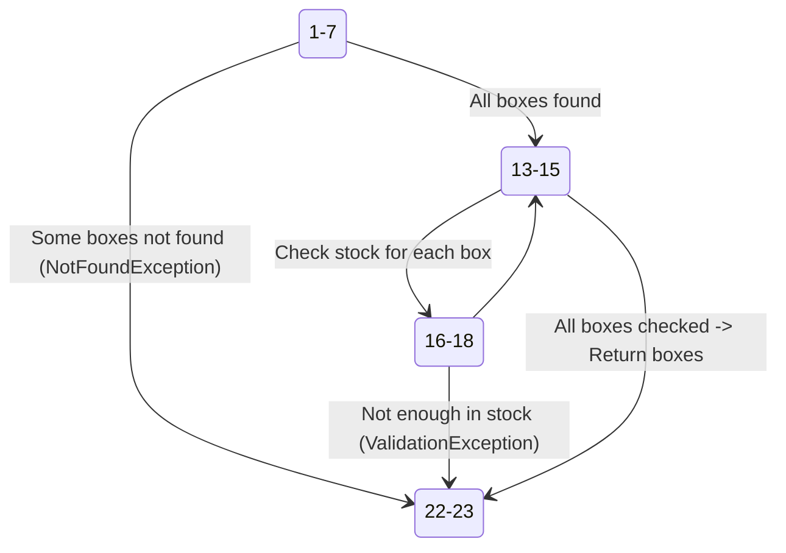

```csharp +line_numbers
public async Task<IEnumerable<Box>> GetBoxesForOderAsync(Dictionary<Guid, int> boxQuantities)
{
    var boxIds = boxQuantities.Keys;
    var boxes = (await boxRepository.GetBoxesByIdsAsync(boxIds)).ToList();

    // Check if all boxes exist
    if (boxes.Count != boxIds.Count)
    {
        var foundBoxIds = boxes.Select(b => b.Id);
        var missingBoxIds = boxIds.Except(foundBoxIds);
        throw new NotFoundException($"Boxes with ids {string.Join(", ", missingBoxIds)} not found");
    }

    // Check if each box is in the required stock
    foreach (var box in boxes)
    {
        var requiredQuantity = boxQuantities[box.Id];
        if (box.Stock < requiredQuantity)
            throw new ValidationException(
                $"Box with id {box.Id} does not have enough stock. Required: {requiredQuantity}, Available: {box.Stock}");
    }

    return boxes;
}
```

<!-- end_slide -->

